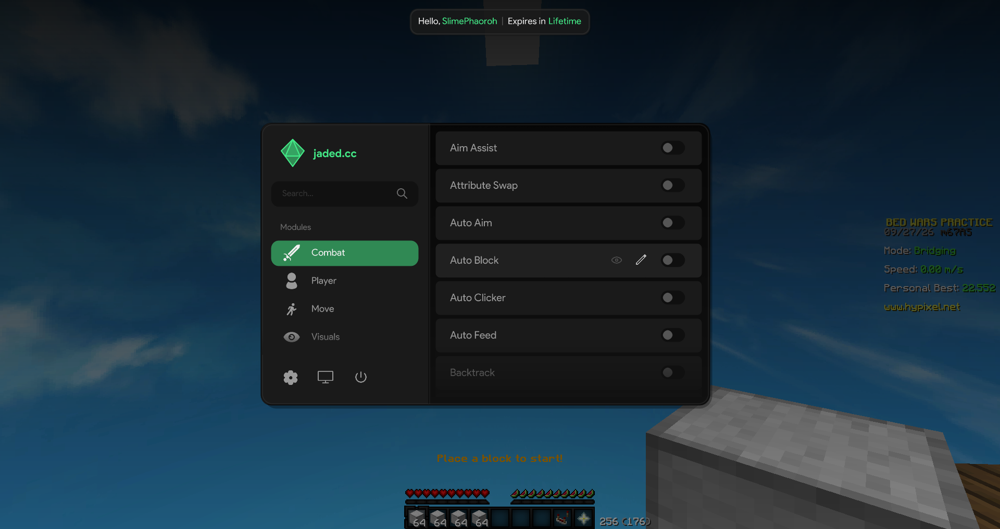

<div align="center">
  
</div>

<div align="center">
  <span style="font-size: 2em; font-weight: bold;">OpenJade</span>
</div>

---

<div align="center">
  
</div>

Jade client, but free. There wasn't really any reason behind this. I don't even know who the Jade developers are, I just did this for fun. This is not Jade's source code, just a reconstruction from a memory dump, so some behavior might be different.

**Injector note:** The included injector is not Jade's original injector. It's a simple Java substitute for loading this build; there's no need to use their original injector with it.

## Building

You need JDK 8 for the client. Building the loader requires Windows, a 64-bit JDK 17+, and MinGW-w64 GCC on PATH (or pass `-Pgcc=C:/mingw64/bin/gcc.exe`). The native bridge is compiled and bundled into the loader JAR.

Client jar:

```powershell
cd JadeClient
.\build.ps1
```

The client jar is written to `JadeClient/dist/jade-source-built.jar`.

```powershell
cd jade-loader
.\gradlew.bat build
```

Set `JAVA_HOME` to a JDK 17+ installation if your default Java is older. The first build downloads Gradle. Output: `jade-loader/build/libs/jade-loader.jar`.

## Using it

1. Copy `jade-loader/build/libs/jade-loader.jar` and `JadeClient/dist/jade-source-built.jar` into a folder of your choice. Rename `jade-source-built.jar` to `jade.jar`.
2. Start Minecraft then double-click `jade-loader.jar`.
3. Click **Load Jade**.

Your folder should look like this:

```text
Jade/
  jade-loader.jar
  jade.jar
```

```powershell
java -jar .\jade-loader.jar
```

Only Lunar and Forge have been tested. 
Java 17 is required to run the loader, if it errors that's probbaly why.
